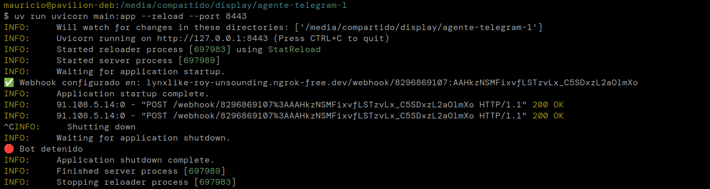

El script `setup_webhook.py` se ejecuta **una sola vez** a objeto de registrar el dominio del webhook en la API de Telegram.

```bash
uv run setup_webhook.py
```

Justo después, la aplicación se sirve mediante Gunicorn, aplicando la configuración definida en gunicorn_config.py.

```bash
uv run gunicorn -c gunicorn_config.py main:app
```

El servicio siempre debe ejecutarse en el puerto `8443`.

```bash
uv run uvicorn main:app --reload --port 8443
```


