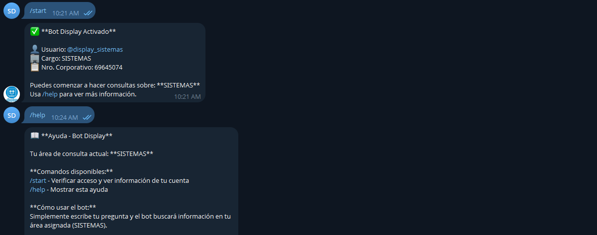

Como primer paso, el usuario deberá ejecutar el comando `/start` para verificar si tiene autorización para utilizar el bot de Telegram.




Durante este proceso, el sistema realiza una consulta a la base de datos **MySQL** con el fin de comprobar si el nombre de usuario se encuentra registrado. Para dicha validación se utiliza el valor almacenado en la columna `usuario_telegram` de la tabla correspondiente:

```
+------------------+-----------------+------+-----+---------+----------------+
| Field            | Type            | Null | Key | Default | Extra          |
+------------------+-----------------+------+-----+---------+----------------+
| id               | bigint unsigned | NO   | PRI | NULL    | auto_increment |
| cargo            | varchar(255)    | NO   |     | NULL    |                |
| nro_coorporativo | varchar(255)    | NO   |     | NULL    |                |
| usuario_telegram | varchar(255)    | NO   |     | NULL    |                |
| estado           | tinyint(1)      | NO   |     | 1       |                |
| created_at       | timestamp       | YES  |     | NULL    |                |
| updated_at       | timestamp       | YES  |     | NULL    |                |
| deleted_at       | timestamp       | YES  |     | NULL    |                |
+------------------+-----------------+------+-----+---------+----------------+
```

Es importante destacar que el bot también verifica que el usuario haya configurado previamente un nombre de usuario en Telegram, ya que esta opción no es obligatoria al momento de crear la cuenta.


Una vez validado el registro en la base de datos, el sistema determina automáticamente el área correspondiente al usuario, más específicamente, el manual asociado a dicha área. A partir de esta asignación, el usuario queda habilitado para interactuar con el bot, realizar consultas y plantear sus inquietudes.

El formato de la solicitud es la siguiente:

```json
{
  "question": "cuales son mis responsabilidades?",
  "area": "sistemas",
  "top_k": 5
}
```

El valor de `area` en este caso se determinará a partir del valor de la columna `cargo` en la tabla vista anteriormente.


