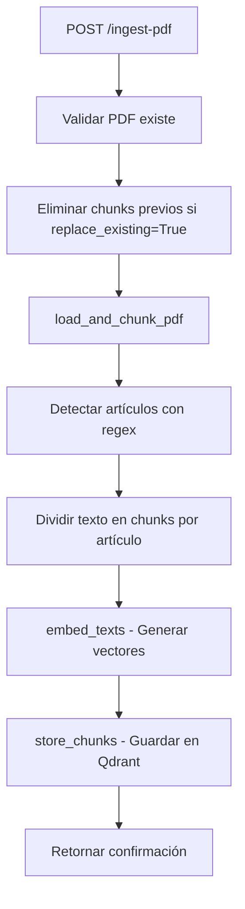
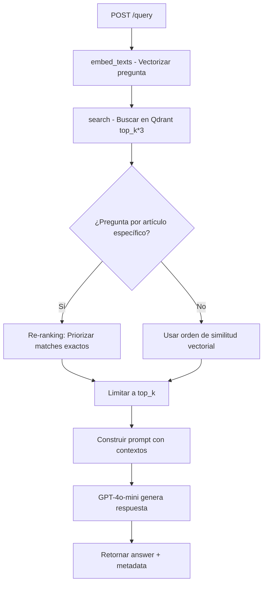

# 📚 RAG-CORE - Documentación Técnica Completa

## 🎯 Propósito del Sistema

Sistema RAG (Retrieval-Augmented Generation) especializado en documentos legales bolivianos. Permite:

- ✅ **Consultas simples**: "¿Qué dice el artículo 10?"
- ✅ **Análisis de casos**: Proporcionar un caso y obtener análisis legal basado en documentos indexados
- ✅ **Multi-documento**: Soporta múltiples PDFs por categoría (ej: 20+ leyes penales)
- ✅ **Multi-categoría**: Cada documento puede pertenecer a varias categorías

---

## 📁 Estructura de Archivos

```
rag-core/
├── main.py              # API FastAPI con endpoints de ingesta y consulta
├── data_loader.py       # Carga y chunking de PDFs
├── vector_db.py         # Gestión de Qdrant (vector database)
├── gunicorn_config.py   # Configuración del servidor
├── pyproject.toml       # Dependencias Python
├── Dockerfile           # Imagen Docker
└── pdfs/                # Directorio de PDFs a ingestar
```

---

## 📄 main.py - API Principal

### Imports y Configuración

```python
from fastapi import FastAPI, HTTPException
from pydantic import BaseModel
from typing import Optional, List
from data_loader import embed_texts
from vector_db import QdrantStorage
import logging
```

**Propósito**: Configurar FastAPI, logging y dependencias.

### Modelos de Datos

#### IngestRequest

```python
class IngestRequest(BaseModel):
    pdf_path: str              # Ruta del PDF en /pdfs/
    doc_id: str                # ID único del documento
    category_ids: List[int]    # [1,2,3...] Categorías del documento
    area: str = "general"      # Área temática (opcional)
    replace_existing: bool     # Si True, elimina chunks previos del doc_id
```

**Uso**: Definir qué PDF ingestar y cómo categorizarlo.

#### QueryRequest

```python
class QueryRequest(BaseModel):
    question: str                      # Pregunta del usuario
    area: Optional[str] = "general"    # Filtro por área
    doc_id: Optional[str] = None       # Filtro por documento específico
    status: Optional[str] = "active"   # Solo docs activos
    category_ids: Optional[List[int]]  # Filtrar por categorías
    top_k: int = 10                    # Número de contextos a recuperar
```

**Uso**: Definir la consulta y filtros aplicables.

### Endpoint: POST /ingest-pdf

**Líneas 45-128**

```python
@app.post("/ingest-pdf")
async def ingest_pdf_endpoint(request: IngestRequest):
```

**Flujo**:

1. **Validar PDF** (línea 52-56): Verifica que el archivo existe
2. **Eliminar chunks previos** (línea 59-69): Si `replace_existing=True`
3. **Cargar y fragmentar PDF** (línea 72): Usa `load_and_chunk_pdf()`
4. **Generar embeddings** (línea 75): Convierte texto a vectores
5. **Guardar en Qdrant** (línea 78-86): Almacena con metadata
6. **Retornar resumen** (línea 88-96): Confirma ingesta

**Metadata guardada por chunk**:

- `text`: Contenido del fragmento
- `source`: Nombre del PDF
- `doc_id`: ID del documento
- `chunk_index`: Posición del chunk
- `area`: Área temática
- `status`: "active" o "inactive"
- `category_ids`: Lista de categorías

### Endpoint: POST /query

**Líneas 132-230**

```python
@app.post("/query")
async def rag_query(request: QueryRequest):
```

**Flujo**:

1. **Generar embedding** (línea 143):

   ```python
   query_vec = embed_texts([request.question])[0]
   ```

   Convierte la pregunta en vector de 3072 dimensiones.

2. **Búsqueda vectorial con over-fetching** (línea 146-154):

   ```python
   found = store.search(
       query_vector=query_vec,
       top_k=request.top_k * 3,  # Traer 3x más para re-ranking
       category_ids=request.category_ids
   )
   ```

   **¿Por qué 3x?** Para tener margen para el re-ranking.

3. **RE-RANKING HÍBRIDO** (línea 157-179):

   ```python
   article_match = re.search(r'art[ií]culo\s+(\d+)', request.question, re.IGNORECASE)

   if article_match:
       target_article = article_match.group(1)

       # Separar matches exactos
       exact_matches = [ctx for ctx in contexts
                       if re.search(rf'Art[ií]culo\s+{target_article}[\.\s]', ctx)]
       other_contexts = [ctx for ctx in contexts
                        if ctx not in exact_matches]

       # Re-ordenar: exactos primero
       contexts = exact_matches + other_contexts
   ```

   **Propósito**: Si el usuario pregunta por "artículo 6", priorizar chunks que contengan exactamente "Artículo 6".

4. **Limitar a top_k** (línea 181):

   ```python
   found["contexts"] = found["contexts"][:request.top_k]
   ```

5. **Construir prompt para LLM** (línea 196-203):

   ```python
   context_block = "\n\n".join(f"- {c}" for c in found["contexts"])

   user_content = (
       f"Usa el siguiente contexto para responder la pregunta.\n\n"
       f"Contexto:\n{context_block}\n\n"
       f"Pregunta: {request.question}\n\n"
       "Responde de manera concisa usando únicamente el contexto proporcionado."
   )
   ```

6. **Llamar a GPT-4o-mini** (línea 205-217):

   ```python
   completion = openai_client.chat.completions.create(
       model="gpt-4o-mini",
       messages=[
           {"role": "system", "content": "Eres un asistente legal..."},
           {"role": "user", "content": user_content}
       ],
       temperature=0.3
   )
   ```

   **Temperature 0.3**: Respuestas más determinísticas y precisas.

7. **Retornar respuesta** (línea 219-227):
   ```json
   {
       "answer": "...",
       "sources": ["CODIGO_PENAL.pdf"],
       "doc_ids": ["2"],
       "num_contexts": 10,
       "filters_applied": {...}
   }
   ```

---

## 📄 data_loader.py - Carga y Chunking

### Configuración Global

```python
EMBED_MODEL = "text-embedding-3-large"  # Modelo de OpenAI
EMBED_DIM = 3072                        # Dimensión del vector
splitter = SentenceSplitter(chunk_size=1024, chunk_overlap=200)
```

**Chunk size**: 1024 caracteres (fallback para artículos muy largos)
**Overlap**: 200 caracteres para mantener contexto entre chunks

### Función: clean_text()

**Líneas 22-35**

```python
def clean_text(text: str) -> str:
    patterns = [
        r"TEXTO DE CONSULTA",
        r"Derechos Reservados © Gaceta Oficial de Bolivia",
        r"\"2022 AÑO DE LA REVOLUCIÓN CULTURAL...",
        r"Gaceta Oficial de Bolivia",
    ]
    for p in patterns:
        text = re.sub(p, "", text, flags=re.IGNORECASE)

    text = re.sub(r'\n\s*\n', '\n\n', text)
    return text.strip()
```

**Propósito**: Eliminar headers/footers repetitivos que generan ruido en embeddings.

### Función: load_and_chunk_pdf()

**Líneas 38-75**

**Estrategia de Chunking Basada en Artículos**:

1. **Leer PDF completo** (línea 40-42):

   ```python
   docs = PDFReader().load_data(file=path)
   full_text = "\n".join([d.text for d in docs])
   cleaned_text = clean_text(full_text)
   ```

2. **Detectar artículos con regex** (línea 45-49):

   ```python
   article_pattern = r"(?i)Artículo\s+\d+[\.\s]"
   split_points = [m.start() for m in re.finditer(article_pattern, cleaned_text)]
   ```

   **Ejemplo**: Detecta "Artículo 1.", "ARTÍCULO 25 ", etc.

3. **Dividir en puntos de artículos** (línea 56-71):
   ```python
   for i in range(len(split_points)):
       start = split_points[i]
       end = split_points[i+1] if i+1 < len(split_points) else len(cleaned_text)
       chunk_text = cleaned_text[start:end].strip()

       # Si es muy largo, subdividir
       if len(chunk_text) > 2000:
           sub_chunks = splitter.split_text(chunk_text)
           chunks.extend(sub_chunks)
       else:
           chunks.append(chunk_text)
   ```

**Ventajas**:

- ✅ Cada artículo completo en un chunk (si es <2000 chars)
- ✅ Mejor contexto para el LLM
- ✅ Ideal para leyes estructuradas

### Función: embed_texts()

**Líneas 78-87**

```python
def embed_texts(texts: list[str]) -> list[list[float]]:
    response = client.embeddings.create(
        model=EMBED_MODEL,
        input=texts,
    )
    return [item.embedding for item in response.data]
```

**Entrada**: Lista de textos
**Salida**: Lista de vectores de 3072 dimensiones
**Costo**: ~$0.00013 por 1000 tokens

---

## 📄 vector_db.py - Gestión de Qdrant

### Clase: QdrantStorage

**Líneas 13-213**

#### **init**()

```python
def __init__(self):
    self.client = QdrantClient(host=QDRANT_HOST, port=QDRANT_PORT)
    self.collection = QDRANT_COLLECTION
    self._ensure_collection()
```

**Propósito**: Conectar a Qdrant y asegurar que la colección existe.

#### \_ensure_collection()

**Líneas 27-50**

```python
def _ensure_collection(self):
    if not self.client.collection_exists(self.collection):
        self.client.create_collection(
            collection_name=self.collection,
            vectors_config=VectorParams(size=EMBED_DIM, distance=Distance.COSINE)
        )
```

**Distance.COSINE**: Mide similitud entre vectores (0=opuestos, 1=idénticos)

#### store_chunks()

**Líneas 52-75**

```python
def store_chunks(
    self,
    chunks: List[str],
    embeddings: List[List[float]],
    metadata: Dict
):
    points = []
    for i, (chunk, emb) in enumerate(zip(chunks, embeddings)):
        payload = {
            "text": chunk,
            "source": metadata.get("source", ""),
            "doc_id": metadata.get("doc_id", ""),
            "chunk_index": i,
            "area": metadata.get("area", "general"),
            "status": metadata.get("status", "active"),
            "category_ids": metadata.get("category_ids", [])
        }
        points.append(PointStruct(id=str(uuid.uuid4()), vector=emb, payload=payload))

    self.client.upsert(collection_name=self.collection, points=points)
```

**UUID**: Genera IDs únicos para cada chunk
**Upsert**: Inserta o actualiza si ya existe

#### search()

**Líneas 77-155**

**Búsqueda con Filtros**:

```python
def search(
    self,
    query_vector: List[float],
    top_k: int = 5,
    category_ids: Optional[List[int]] = None,
    status: Optional[str] = "active"
):
    filter_conditions = []

    if category_ids:
        filter_conditions.append(
            FieldCondition(key="category_ids", match=MatchAny(any=category_ids))
        )

    if status:
        filter_conditions.append(
            FieldCondition(key="status", match=MatchValue(value=status))
        )

    query_filter = Filter(must=filter_conditions) if filter_conditions else None

    results = self.client.search(
        collection_name=self.collection,
        query_vector=query_vector,
        query_filter=query_filter,
        limit=top_k
    )
```

**MatchAny**: Busca puntos donde `category_ids` contenga **al menos uno** de los IDs proporcionados.

**Ejemplo**:

- Chunk tiene `category_ids: [1, 2, 3]`
- Usuario busca con `category_ids: [2]`
- ✅ Match (porque 2 está en [1,2,3])

---

## 🔄 Flujo Completo de Ingesta



## 🔍 Flujo Completo de Consulta



---

## 🎯 Capacidades del Sistema

### ✅ Consultas Simples

**Ejemplo**:

```json
{
  "question": "Que dice el articulo 25 del codigo penal",
  "category_ids": [2],
  "top_k": 5
}
```

**Respuesta**: El LLM extrae y resume el artículo 25.

### ✅ Análisis de Casos

**Ejemplo**:

```json
{
  "question": "Tengo un caso de robo agravado donde el acusado entró a una vivienda de noche con arma blanca. ¿Qué artículos del código penal aplican y cuál sería la pena?",
  "category_ids": [2],
  "top_k": 15
}
```

**Cómo funciona**:

1. El sistema busca los 15 chunks más relevantes sobre "robo agravado", "arma blanca", "vivienda", etc.
2. GPT-4o-mini analiza esos contextos y genera una respuesta legal
3. Cita los artículos específicos encontrados

**Limitación**: Solo puede analizar con la información en los chunks recuperados. Si necesita artículos que no están en el top 15, no los considerará.

**Solución**: Aumentar `top_k` para casos complejos (ej: 20-30).

### ✅ Multi-Documento

**Escenario**: 20 leyes penales ingresadas

```python
# Ingestar cada ley
for ley in ["CODIGO_PENAL.pdf", "LEY_004.pdf", "LEY_025.pdf", ...]:
    POST /ingest-pdf {
        "pdf_path": ley,
        "doc_id": f"penal_{i}",
        "category_ids": [2],  # Categoría Penal
        "replace_existing": True
    }
```

**Consulta**:

```json
{
  "question": "Que dice la ley sobre violencia domestica",
  "category_ids": [2],
  "top_k": 20
}
```

El sistema buscará en **todos** los documentos con `category_ids` que contengan 2.

---

## 🚀 Ingesta del Área Penal

### Preparación

1. **Copiar PDFs** a `rag-core/pdfs/`:

   ```
   pdfs/
   ├── CODIGO_PENAL.pdf
   ├── CODIGO_PROCEDIMIENTO_PENAL.pdf
   ├── LEY_004.pdf
   ├── LEY_025.pdf
   └── ... (hasta 20 documentos)
   ```

2. **Script de ingesta masiva**:

   ```python
   import requests

   pdfs = [
       "CODIGO_PENAL.pdf",
       "CODIGO_PROCEDIMIENTO_PENAL.pdf",
       "LEY_004.pdf",
       # ... más PDFs
   ]

   for i, pdf in enumerate(pdfs):
       response = requests.post("http://localhost:8000/ingest-pdf", json={
           "pdf_path": pdf,
           "doc_id": f"penal_{i+1}",
           "category_ids": [2],  # Categoría Penal
           "area": "penal",
           "replace_existing": True
       })
       print(f"Ingested {pdf}: {response.status_code}")
   ```

### Categorías Sugeridas

| ID  | Categoría      |
| --- | -------------- |
| 1   | Constitucional |
| 2   | Penal          |
| 3   | Civil          |
| 4   | Laboral        |
| 5   | Administrativo |
| 6   | Tributario     |
| 7   | Comercial      |
| 8   | Familia        |
| 9   | Ambiental      |

---

## ⚙️ Configuración y Variables de Entorno

### .env (raíz del proyecto)

```env
OPENAI_API_KEY=sk-...
QDRANT_HOST=qdrant
QDRANT_PORT=6333
QDRANT_COLLECTION=legal_docs
```

### Recursos Recomendados

**Para 20 documentos (~10MB total)**:

- **RAM**: 4GB mínimo
- **Qdrant**: 2GB de almacenamiento
- **OpenAI**: ~$5-10 para ingesta completa

---

## 🐛 Debugging

### Ver logs del RAG

```bash
docker compose logs -f rag-core
```

### Ver contenido de Qdrant

```python
from qdrant_client import QdrantClient
client = QdrantClient(host="qdrant", port=6333)
print(client.count(collection_name="legal_docs"))
```

### Test de endpoint

```bash
curl -X POST http://localhost:8000/query \
  -H "Content-Type: application/json" \
  -d '{"question": "articulo 1", "top_k": 5}'
```

---

## 📊 Métricas de Rendimiento

| Operación             | Tiempo Estimado |
| --------------------- | --------------- |
| Ingesta 1 PDF (500KB) | 30-60 segundos  |
| Consulta simple       | 2-5 segundos    |
| Análisis de caso      | 5-10 segundos   |

---

## 🔐 Seguridad

- ✅ Validación de rutas de archivos
- ✅ Filtrado por `status: active`
- ✅ Control de acceso por `category_ids`
- ⚠️ **Pendiente**: Autenticación de API (agregar API keys)

---

## 📝 Notas Importantes

1. **Re-ranking solo para artículos**: Si la pregunta no menciona "artículo X", usa similitud vectorial pura.
2. **Overlap en chunks**: Los 200 caracteres de overlap aseguran que no se pierda contexto entre fragmentos.
3. **Temperature 0.3**: Respuestas más consistentes y menos creativas (ideal para legal).
4. **Top-K dinámico**: Para casos complejos, usar `top_k: 20-30` para mejor cobertura.

---

## 🎓 Próximos Pasos

1. ✅ Ingestar 20 documentos penales
2. ✅ Probar análisis de casos complejos
3. 🔄 Agregar autenticación a la API
4. 🔄 Implementar caché de consultas frecuentes
5. 🔄 Agregar métricas de relevancia (feedback del usuario)
