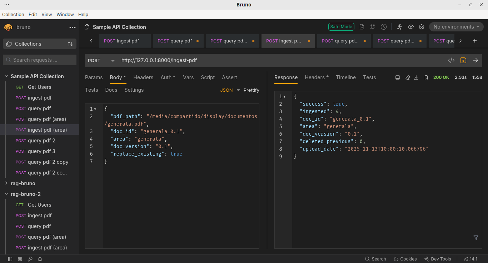
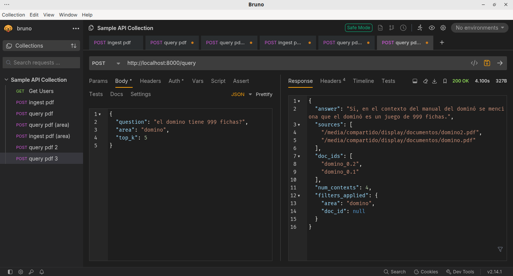
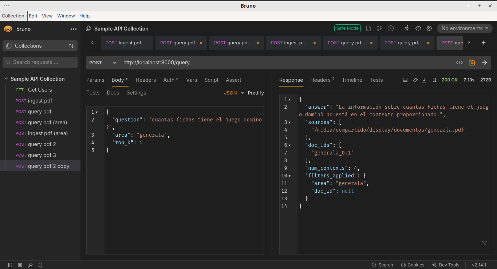
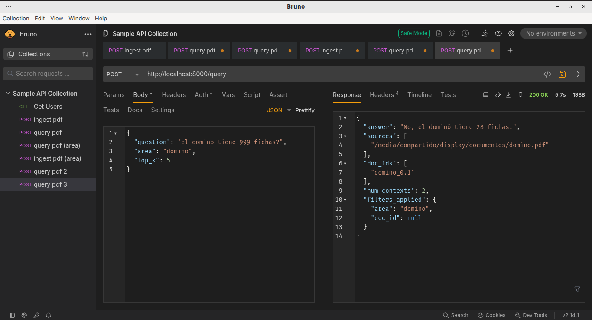
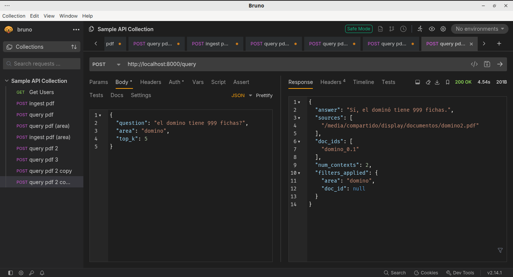

# Ingesta de Documentos

La ingesta de documentos en la REST API sigue el siguiente formato:

```json
{
  "pdf_path": "/media/compartido/display/documentos/domino.pdf",
  "doc_id": "manual-domino",
  "area": "domino",
  "doc_version": "0.1",
  "replace_existing": true
}
```

Es importante mencionar la REST API no recibe documentos, **el cliente no sube archivos**, solo establece la ruta **en el servidor** donde se halla el recurso.



Más allá del archivo, los parámetros más importantes son `doc_id` y `replace_existing`que se encargará de **reemplazar la versión anterior del documento.**

## Remplazo de Versión Anterior

```json
{
  "pdf_path": "/media/compartido/display/documentos/domino2.pdf",
  "doc_id": "manual-domino",
  "area": "domino",
  "doc_version": "0.2",
  "replace_existing": true
}
```

Para vectorizar un nuevo documento el parámetro más importante de la solicitud será `doc_id` el cuál deberá **contener exactamente el mismo valor que se utilizó en la ingesta anterior**. De lo contrario, el RAG responderá tomando como referencia tanto `domino.pdf` como `domino2.pdf` para generar las respuestas.

Otro punto a tomar en cuenta es el valor de `replace_existing` que siempre debe adoptar `true`.

Ejemplo, uso erróneo:

```json
{
  "pdf_path": "/media/compartido/display/documentos/domino2.pdf",
  "doc_id": "manual-domino-2",
  "area": "domino",
  "doc_version": "0.2",
  "replace_existing": true
}
```

Resultado, (2 contextos):



## Conclusiones

De momento se va a mantener la propiedad `doc_id` en caso extremo que un área requiera más de un documento, **lo ideal es que cada área utilice UN SOLO DOCUMENTO**.

# Consultas

Una vez realizada la ingesta correcta de los documentos correspondientes, el parámetro más importante en la consulta es por supuesto `area`:

```json
{
  "question": "cuantas fichas tiene el juego domino?",
  "area": "domino",
  "top_k": 5
}
```

Consulta que hace alusión a un área completamente descontextualizada:



Ejemplo de consultas con ingesta actualizada; `domino.pdf`:



`domino2.pdf`:


